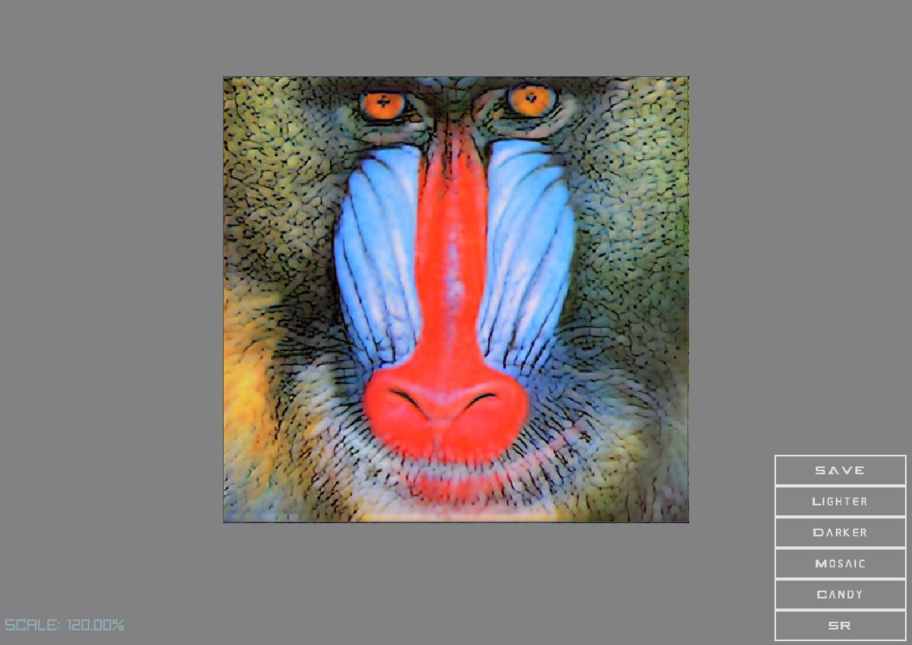

<h1 align="center">TorchRayLib++: A CMake based generative art concept, integrating rayLib GUI and PyTorch C++ Deep Learning Library.</h1>
      
<p align="center">
  <a href="#about">About</a> •
  <a href="#credits">Credits</a> •
  <a href="#installation">Installation</a> •  
  <a href="#fexamples">Examples</a> •  
  <a href="#author">Author</a> •  
  <a href="#license">License</a>
</p>

<h1 align="center">    
  </a>  
</h1>

---

## About

<table>
<tr>
<td>
  
**TorchRayLib++** is a CMake based **integration** of the well-known **_raylib GUI_** library 
with my favourite Deep Learning Library Libtorch: the **_PyTorch_** C++ frontend, mainly for working on the **_GPU_** 
but also works on the CPU. It is mainly targeted at generative art models with a premise that new models acn bea easily integrated. 

**There are no OpenCV dependencies for reading and writing images!**. Everything is self-contained using stb_image (part of raylib).   
 
<h1 align="left">    
  </a>  
</h1>

**Why??++** Because its fun, for gaming, for deep learning researchers, for generating art, for AI, for reinforcement learning, 
because the PyTorch community does not have a dedicated UI that allows the easy execution of CNN models. 

# Deep Learning Models (Libtorch C++)
 
 <div align='center'>
 <table>
    <th>Image</th>
   <th>Model name</th>
   <th><code>Traced C++ PT</code><br/></th>      
   <tr>          
     <td></td>
     <td>NeuralStyle Mosaic/Candy</br> </td>
     <td>./resources/candy.pt</td>         
   </tr>      
   
   <tr> 
   <td></td>         
    <td>ESRGAN SR</td>
    <td>./resources/RRDB_ESRGAN_x4_000.pt</td>         
    </tr>
      
 </table>
 </div>
 

 

# GPU or CPU?  
If you want to test on a CPU you will have to edit CMakeLists:

GPU mode:
```cmake
set(CUDA_V "10.2")
set(LIBTORCH_DEVICE "cu102")
```
CPU mode: 
```cmake
set(CUDA_V "cpu")
set(LIBTORCH_DEVICE "cpu")
```
**Note**: Tested only on **GPU with CUDA 10.2 and a CPU on a Windows 10 machine**. 

## RayLib 
RayLib is an amazing library which has been widely adopted by the gaming community. 
Read more about the raylib game framework here: https://www.raylib.com/
Or look up projects using it here:
https://www.google.com/search?q=raylib+site:github.com   

## PyTorch / Libtorch C++ 
PyTorch is a Python package that provides two high-level features, Tensor computation (like NumPy) with strong GPU acceleration
Deep neural networks built on a tape-based autograd system. In this project we use the C++ version entitled Libtorch. 
https://pytorch.org/ 

## Alpha release
Try it here: https://github.com/QuantScientist/TorchRayLib/releases 
**Note**: it is a huge file because of the included orch / NVIDIA CUDA runtime files.    
 
  
<p align="right">
<sub>(Preview)</sub>
</p>

</td>
</tr>
</table>

## A simple example 
The folowing example create a ray window, allocates a `torch::tensor` on the GPU and draws the value 
into a ray window. 
 
```cpp
#include "raylib.h"
#include <torch/script.h>

int main(void)
{
    torch::Device device(torch::kCUDA);
    torch::Tensor tensor = torch::eye(3).to(device);
    std::cout<<tensor<<std::endl;
    const int screenWidth = 800;
    const int screenHeight = 450;
    InitWindow(screenWidth, screenHeight, "TorchRayLib:PyTorch GPU random random values (c++17)");

    int framesCounter = 0;          // Variable used to count frames
    auto randValueTorch= (int)(1000 * (torch::rand(1).to(device).data().detach().item().toFloat()));
    int randValue=randValueTorch;

    SetTargetFPS(60);               // Set our game to run at 60 frames-per-second
    while (!WindowShouldClose())    // Detect window close button or ESC key
    {        
        framesCounter++;    
        if (((framesCounter/60)%2) == 1)
        {
            randValue= (int)(10000 * (torch::rand(1).to(device).data().detach().item().toFloat()));
            framesCounter = 0;
        }        
        BeginDrawing();
            ClearBackground(RAYWHITE);
            DrawText("Generate a random value on the GPU using PyTorch", 30, 100, 20, MAROON);
            DrawText(TextFormat("%i", randValue), 200, 180, 100, ORANGE);
        EndDrawing();
    }
    CloseWindow();        // Close window and OpenGL context
    return 0;
}
```

## Credits 
* PyTorch CPP examples by koba-jon https://github.com/koba-jon/pytorch_cpp.
 
* PyTorch CPP examples + CMake build: https://github.com/prabhuomkar/pytorch-cpp/

* For the NeuralStyle transfer models which I traced to C++ see https://github.com/gnsmrky/pytorch-fast-neural-style-for-web 
and https://github.com/pytorch/examples/tree/master/fast_neural_style

* RayLib UI https://github.com/raysan5/raylib which is licensed under 
an unmodified zlib/libpng license (View raylib.h for details) Copyright (c) 2014 Ramon Santamaria (@raysan5) 


## Features

|                            | 🔰 TorchRayLib++ CMake  | |
| -------------------------- | :----------------: | :-------------:|
| PyTorch CPU tensor to ray Image        |         ✔️                 
| PyTorch GPU tensors to ray image       |         ✔️                 
| Libtorch C++ 1.6           |         ✔️                 
| RayLib                     |         ✔️                 


## Examples

#### A Simple example, mainly for testing the integration. Allocates a tensor on the GPU without ray.

- https://github.com/QuantScientist/TorchRayLib/blob/master/src/torch_ray_sanity.cpp

#### Allocate a random tensor on the GPU with ray.

- https://github.com/QuantScientist/TorchRayLib/blob/master/src/torch_core_random_values.cpp

#### Use a timer, and each second allocate a new random number on the GPU, and then display it using ray. 

- https://github.com/QuantScientist/TorchRayLib/blob/master/src/torch_core_random_values.cpp
 
#### Load a trained PyTorch NeuralStyle transfer model in C++ (**see pth folder**), load an Image in C++, run a trained pytorch model on it and save the output.


#### Super resolution demo using ESRGAN


## Requirements:
* Windows 10 and Microsoft Visual C++ 2019 16.4, Linux is not supported at the moment.
* NVIDIA CUDA 10.2. I did not test with any other CUDA version. 
* PyTorch / LibTorch c++ version 1.6.  
* 64 bit only.  
* CMake 3.18  
* libpng, png++ 
* RayLib GUI


## Installation / building using CMake

**CMake** should take care of everything for you! CLion is strongly recommended for the build. Please setup CLion as follows: 


#### Downloading and installing steps LIBTORCH C++:

The **CMake file will download this automatically for you**.   
Credits: https://github.com/prabhuomkar/pytorch-cpp/

* **[Download]()** the latest version of Libtorch for Windows here: https://pytorch.org/.

* **Go** to the following path: `mysiv3dproject/`
* Place the **LiBtorch ZIP** folder (from .zip) inside the **project** folder as follows `mydproject/_deps/libtorch/`:  

#### Downloading and installing steps RayLib:
The **CMake file will download this automatically for you**.

* **[Download]()** 

## A CMake example for a target 
   
```cmake
include(copy_torch_dlls)
################# EXAMPLE 001 ########################
# TARGET
set(EXAMPLE_001_EXE torch_ray_sanity)
add_executable(${EXAMPLE_001_EXE} src/${EXAMPLE_001_EXE}.cpp)
set(raylib_VERBOSE 1)
target_link_libraries(${EXAMPLE_001_EXE} raylib  ${TORCH_LIBRARIES})
#target_link_libraries(${PROJECT_NAME} m)
target_include_directories(${EXAMPLE_001_EXE} PUBLIC "${CMAKE_CURRENT_SOURCE_DIR}/_dpes/libtorch/include/")
target_include_directories(${EXAMPLE_001_EXE} PUBLIC "${CMAKE_CURRENT_SOURCE_DIR}/_deps/libtorch/include/torch/csrc/api/")
set_target_properties(${EXAMPLE_001_EXE} PROPERTIES
        CXX_STANDARD 17
        CXX_STANDARD_REQUIRED YES)
copy_torch_dlls(${EXAMPLE_001_EXE})
```
 
## Inference
For inference, you have to copy all the **Libtorch DLLs** to the location of the executable file. For instance:
This is **done automatically** for you in the CMake file. 

````cmake
function(copy_torch_dlls TARGET_NAME)    
    list(GET CMAKE_MODULE_PATH 0 CMAKE_SCRIPT_DIR)    
    add_custom_command(TARGET ${TARGET_NAME}
                       POST_BUILD
                       COMMAND ${CMAKE_COMMAND}
                       -D "TORCH_INSTALL_PREFIX=${TORCH_INSTALL_PREFIX}"
                       -D "DESTINATION_DIR=$<TARGET_FILE_DIR:${TARGET_NAME}>" 
                       -P "${CMAKE_SCRIPT_DIR}/create_torch_dll_hardlinks.cmake")
endfunction()
````
 
## Tracing your modeld in PyTorch for inference in C++
For instance, this how to trace the NeuralStyle transfer models from PyTprch to Libtorch so that inference in C++ can work. 
https://github.com/QuantScientist/TorchRayLib/blob/master/model_trace.py 
 
````python
import torch
import torchvision
import re

# https://github.com/gnsmrky/pytorch-fast-neural-style-for-web
from transformer_net import *
style_model = TransformerNet()
m="candy.pth"
state_dict = torch.load("./resources/udnie.pth")
for k in list(state_dict.keys()):
    if re.search(r'in\d+\.running_(mean|var)$', k):
        del state_dict[k]
style_model.load_state_dict(state_dict)
style_model.eval()

# model = torchvision.models.resnet50(pretrained=True)
# model.eval()
example = torch.rand(1, 3, 224, 224)
traced_script_module = torch.jit.trace(style_model, example)
traced_script_module.save("./resources/udnie_cpp.pt")
````  

Then you can load the trained model in C++ like so: 
````cpp
torch::DeviceType device_type = torch::kCPU;
if (torch::cuda::is_available()) {
    device_type = torch::kCUDA;
    std::cout << "Running on a GPU" << std::endl;
} else {
    std::cout << "Running on a CPU" << std::endl;
}
torch::Device device(device_type);
const std::string modelNameMosaic = "mosaic_cpp.pt";
auto moduleCandy = torch::jit::load(modelNameCandy, device);
````

## Contributing

Feel free to report issues during build or execution. We also welcome suggestions to improve the performance of this application.
 

## Citation

If you find the code or trained models useful, please consider citing:

```
@misc{TorchRayLib++,
  author={Kashani, Shlomo},
  title={TorchRayLib++2020},
  howpublished={\url{https://github.com/QuantScientist/TorchRayLib/}},
  year={2020}
}
```

## Contributers 
- https://github.com/CarboSauce helped a lot with the conversion of ray images to Torch and vice versa.
 
## Disclaimers
 
 - "PyTorch" is a trademark of Facebook.
 - No liability. Feel free to submit bugs or fixes.
 - No tech support: this is merely a spare-time fun project for me.
 - Contribution is more than welcomed though.
 - Tested only on Windows 10 with Visual Studio 2019. More OS and dev env support are welcomed.

## Licensing
Bash is free software; you can redistribute it and/or modify it under the terms of the GNU General Public 
License as published by the Free Software Foundation; either version 3 of the License, 
or (at your option) any later version.

- Copyright © [Shlomo Kashani, author of the book "Deep Learning Interviews"](www.interviews.ai)
Shlomo Kashani, Author of the book _Deep Learning Interviews_ www.interviews.ai: entropy@interviews.ai


## Third party licences:
- raylib is licensed under an unmodified zlib/libpng license, which is an OSI-certified, 
BSD-like license that allows static linking with closed source software. Check LICENSE for further details.

- NVIDIA CUDA license https://docs.nvidia.com/cuda/eula/index.html 

- PyTorch https://github.com/pytorch/pytorch/blob/master/LICENSE

# References
- https://github.com/raysan5/raylib
- https://github.com/RobLoach/raylib-cpp
- https://github.com/koba-jon/pytorch_cpp 
- https://github.com/Maverobot/libtorch_examples
- https://github.com/threeYANG/libtorch-SSD
- https://github.com/BuffetCodes/Linear-Regression-using-PyTorch-CPP
- https://github.com/lsrock1/maskrcnn_benchmark.cpp
- https://lernapparat.de/pytorch-traceable-differentiable/
- http://lernapparat.de/static/artikel/pytorch-jit-android/thomas_viehmann.pytorch_jit_android_2018-12-11.pdf
- https://github.com/walktree/libtorch-yolov3
